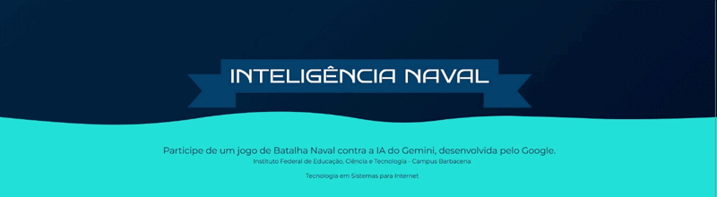

# Inteligência Naval

<p align="center">
  <strong>Participe de um jogo de Batalha Naval contra a IA do Gemini, desenvolvida pelo Google.</strong>
  <br><br>
  Projeto desenvolvido para demonstrar como um modelo de linguagem pode participar de um jogo estratégico utilizando apenas troca de mensagens em formato JSON.
</p>



<p align="center">
  
  
  
  
  
</p>

---

## Sobre o projeto

A **Inteligência Naval** é um jogo de **Batalha Naval** onde o adversário é a **IA Gemini**, desenvolvida pelo Google.

O projeto foi desenvolvido como trabalho de conclusão da disciplina **Linguagem de Programação Visual**, do curso **Tecnologia em Sistemas para Internet**, no **Instituto Federal de Educação, Ciência e Tecnologia do Sudeste de Minas Gerais (IF Sudeste MG)**.

O principal objetivo é demonstrar, na prática, como a API gratuita do Gemini pode ser utilizada para permitir que uma inteligência artificial participe de um jogo relativamente complexo, mesmo sem possuir acesso direto à interface da aplicação.

Todo o funcionamento do jogo acontece **inteiramente no front-end**.


---

## Funcionalidades

- Jogue Batalha Naval contra a IA do Gemini.
- IA baseada em prompts cuidadosamente elaborados.
- Explicação do raciocínio da IA a cada jogada.
- Comunicação estruturada utilizando JSON.
- Modo **Jogar contra o Piloto Automático** para iniciar partidas sem depender da API do Gemini.
- Possibilidade de jogar utilizando sua própria chave gratuita do Gemini.
- Interface com instruções para usuários iniciantes.

---

# Design

O design da Inteligência Naval utiliza uma paleta de cores azuis e ciano, para dar uma temática marítima adequada para um jogo de Batalha Naval.

Os materiais que criamos e utilizamos como inspiração para guiar o nosso desenvolvimento estão disponíveis abaixo:
[](https://github.com/Leite-777/inteligencia_naval/blob/main/docs/Moodboard.png)
[](https://github.com/Leite-777/inteligencia_naval/blob/main/docs/Wireframe.png)
[](https://github.com/Leite-777/inteligencia_naval/blob/main/docs/Mockup.png)

O convite para avaliação do website, utilizado para coletar feedbacks e desenvolver melhorias para o projeto, está disponível abaixo:
[](https://github.com/Leite-777/inteligencia_naval/blob/main/docs/Convite%20para%20Avalia%C3%A7%C3%A3o%20de%20Jogo.pdf)

---

# Como a IA funciona

Modelos de linguagem como o **Gemini** ou o **ChatGPT** não conseguem interagir diretamente com páginas web.

Eles apenas recebem texto como entrada e produzem texto como saída.

Para contornar essa limitação, o jogo utiliza a **API do Gemini**, enviando automaticamente uma descrição completa do estado atual da partida.

Em cada rodada, o jogo converte os tabuleiros para uma estrutura **JSON**, contendo todas as informações necessárias para que o modelo tome uma decisão.

O prompt enviado inclui:

- regras completas da Batalha Naval,
- significado de cada valor presente no tabuleiro,
- estado atual dos dois jogadores,
- instruções sobre estratégia,
- formato obrigatório da resposta.

Após analisar os dados, o Gemini responde com:

- a posição escolhida para atacar,
- uma explicação do seu raciocínio,
- uma resposta em formato JSON para que o site processe automaticamente sua jogada.

---

# Piloto Automático

Além da integração com o Gemini, o projeto possui um modo de **Piloto Automático**.

Esse modo utiliza um algoritmo tradicional para realizar jogadas automaticamente, permitindo que:

- o jogo continue caso a API retorne algum erro;
- partidas sejam iniciadas sem uma chave da API;
- o usuário experimente o jogo mesmo sem utilizar o Gemini.

---

# Acessibilidade

O projeto foi pensado para usuários que nunca utilizaram APIs antes.

A aplicação explica de maneira simples:

- como funciona uma chave de API,
- como criar gratuitamente uma chave do Google Gemini,
- como o jogo consegue continuar com erros na chave API ou até mesmo sem uma chave,
- como jogar Batalha Naval,
- como utilizar todos os recursos disponíveis.

---

# Tecnologias utilizadas

- HTML
- CSS
- JavaScript
- TypeScript
- Google Gemini API

---

# Estrutura da comunicação com a IA

```text
Jogador
    │
    ▼
Clique no Tabuleiro
    │
    ▼
Conversão para JSON
    │
    ▼
Prompt detalhado
    │
    ▼
API do Gemini
    │
    ▼
Resposta em JSON
    │
    ▼
Atualização visual do jogo
```

---

# Objetivos do projeto

Este projeto busca demonstrar que é possível utilizar um LLM como agente de decisão em um jogo estratégico apenas através de engenharia de prompts e troca estruturada de dados.

Além disso, procura apresentar de forma didática conceitos como:

- Prompt Engineering;
- consumo de APIs REST;
- manipulação de JSON;
- integração entre aplicações web e modelos de IA;
- desenvolvimento Front-end.

---

# Equipe

| Integrante | GitHub |
| :--- | :---: |
| Gabriel Alvaro | [](https://github.com/g-alvaro-ti) |
| Matheus Leite | [](https://github.com/Leite-777) |
| Breno Emanuel | [](https://github.com/Oliveira-breno) |
| Pamela de Andrade | [](https://github.com/pamelasimoes) |
| Matheus José | [](https://github.com/ma7heus-carvalho) |
| Evandro Rodrigues | [](https://github.com/Evandro0981) |

---

<p align="center">
Desenvolvido como projeto acadêmico para o curso de <strong>Tecnologia em Sistemas para Internet</strong><br>
Instituto Federal de Educação, Ciência e Tecnologia do Sudeste de Minas Gerais
</p>
